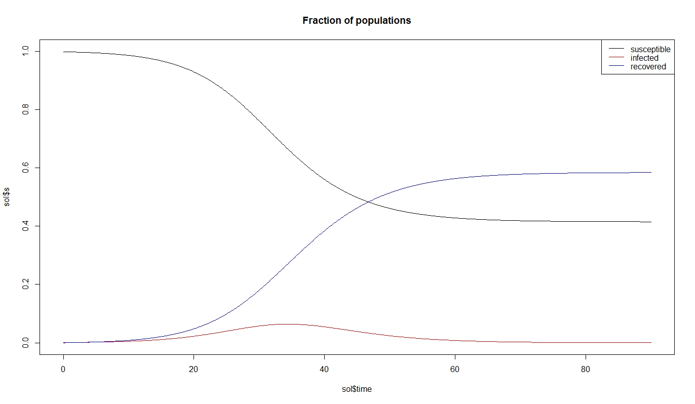

# odeSolveR

<!-- badges: start -->
<!-- badges: end -->

A basic ODE solver using **[Euler scheme](https://en.wikipedia.org/wiki/Euler_method)** and fourth-order **[Runge-Kutta scheme](https://en.wikipedia.org/wiki/Runge%E2%80%93Kutta_methods)** implementations to numerically solve arbitrary first order one dimensional ODEs and systems of first-order ODEs. The default scheme used is the latter RK4 scheme. 

The documentation should be sufficient for setting up custom problems, however, we also provide below a series of examples from the 1970s to the 2000s demonstrating how to use the generic solver. The examples are pulled from S. Strogatz's excellent *Nonlinear Dynamics and Chaos* (2015) with the original authors of the model listed.

# Table of contents
1. [Installation](#installation)

2. [One dimensional ODEs](#one-dimensional-odes)

3. [The SIR model](#the-sir-model)

4. [Arbitrary first-order ODE systems](#arbitrary-first-order-ode-systems)

    a. [Replicating the hard-coded SIR example](#replicating-the-hard-coded-sir-example)
    
    b. [The Lorenz system](#the-lorenz-system)
    
    c. [Vasquez and Redner political opinion dynamics](#vasquez-and-redner-political-opinion-dynamics)
    
    d. [Jordan and Smith Keynesian Cross model](#jordan-and-smith-keynesian-cross-model)
    
    e. [Eigen and Schuster Hypercycle equation](#eigen-and-schuster-hypercycle-equation)
    
    f. [Haken two-mode laser model](#haken-two-mode-laser-model)
    
    g. [LRC circuit](#lrc-circuit)

5. [SIDARTHE examples](#sidarthe-examples)

## Installation

You can install the latest version of odeSolveR on GitHub with:

``` r
devtools::install_github("shill1729/odeSolveR")
```

## One dimensional ODEs
```r
library(odeSolveR)
# The ODE is given in the form y'(t)=f(t, y) with initial y(t_0)=y_0.
# Here we solve y'=cos(t), y(0)=0. The solution is y=sin(t), of course.
f <- function(t, y) cos(t)
y <- ode1(f = f, y0 = 0, tn = 10, n = 5000)
plot(y)
```

## The SIR model

Running an Euler scheme on the SIR model from mathematical epidemiology.

``` r
library(odeSolveR)
# Solution to SIR model with 2 days between contacts, 3 days between recovery
# 90 days out, 
sir.dat <- sir(beta = 1/2, gamma = 1/3, s0 = 50, i0 = 1, tn = 90, n = 1000)
```

## Arbitrary first-order ODE systems

We can solve arbitrary systems using special syntax. As of now, no error handling is implemented so systems with irregularities, singularities, or blow ups will not be handled with any grace...

### Replicating the hard-coded SIR example

This will replicate the above SIR example (without all the plots...) that is implemented as a hard-coded ODE.

```r
library(odeSolveR)
# Numerical parameters
t0 <- 0
tn <- 100
n <- 1000

# Initial conditions
IC <- list(s = 1-0.01, i = 0.01, r = 0)

# Model parameters
parameters <- list(beta = 1/2, gamma = 1/3)

# TODO: need a less hacky fix
list2env(parameters, envir = .GlobalEnv)

# The functions describing rate of change of each state variable in the ODE system
f <- list(function(t, s, i, r) -beta*s*i, 
          function(t, s, i, r) beta*i*s-gamma*i, 
          function(t, s, i, r) gamma*i
          )

# Solve the system via RK4 iterations
sol <- ode(f, IC, parameters, tn = tn, n = n)

# Plotting trajectories
par(mfrow = c(2, 1))
plot_trajectories(sol, legend_names =  c("susceptible", "infected", "recovered"))

# Plotting phase portrait
plot_phase_portrait(sol)
plot3D::points3D(gamma/beta, 0, 1, add = TRUE)

```


### The Lorenz system

As another example of entering in our own ODEs, we can solve the Lorenz system.

```r
library(odeSolveR)

# Numerical parameters
t0 <- 0
tn <- 40
n <- 10000

# Model parameters
parameters <- list(sigma = 10, rho = 28, beta = 8/3)

# TODO: need a less hacky fix to load in parameters so they do not be referenced as parameters$parm in function bodies
list2env(parameters, envir = .GlobalEnv)

# Create the functions that describe the rates of change for each state variable in the ODE system
f <- list(function(t, x, y, z) sigma*(y-x),
          function(t, x, y, z) x*(rho-z)-y,
          function(t, x, y, z) x*y-beta*z
)

# Initial conditions: names and order must match variables appearing after "t" in function definitions above!
IC <- list(x = 1, y = 1, z = 1)
# Solve the system using RK4
sol <- ode(f, IC, parameters, tn = tn, n = n)

# Plot 2 dimension phase space of x-z variables
plot(sol$x, sol$z, type = "l", main = "x-z Phase plane")

# Plot 3 dimensional phase portrait
plot3D::lines3D(x = sol$x, y = sol$y, z = sol$z, main = "3 dimensional phase portrait")
```


### Vasquez and Redner political opinion dynamics

A highly simplified model of political opinion dynamics due to Vasquez and Redner (2004 p. 8489) consisting of a population of rightists (x), leftists (y), and centrists (z). The dynamics folows the assumptions that leftists and rightists never talk to each other but when either talks to a centrist, one of them convinces the other to change his or her political opinion with the winner depending on the sign of a parameter (r). If this parameter is positive, extremists always win and persuade the centrist to move to that end of the spectrum. Otherwise, the centrist pulls the others towards the center.
```r
library(odeSolveR)

# Numerical parameters
t0 <- 0
tn <- 90
n <- 10000

# Model parameters
parameters <- list(r = -0.1)

# TODO: need a less hacky fix to load in parameters so they do not be referenced as parameters$parm in function bodies
list2env(parameters, envir = .GlobalEnv)

# Create the functions that describe the rates of change for each state variable in the ODE system
f <- list(function(t, x, y, z) r*x*z,
          function(t, x, y, z) r*y*z,
          function(t, x, y, z) -r*x*z-r*y*z
)

# Initial conditions
IC <- list(x = 0.5, y = 0.4, z = 0.10)
# Solve the system using RK4
sol <- ode(f, IC, parameters, tn = tn, n = n)

par(mfrow = c(2, 1))
# State trajectories over time
plot(sol$time, sol$x, type = "l", col = "red", ylim = c(0, 1), main = "% of parties over time")
lines(sol$time, sol$y, col = "blue")
lines(sol$time, sol$z, col = "black")

# 3 Dimensional phase portrait
plot3D::lines3D(x = sol$x, y = sol$y, z = sol$z, theta = 120, main = "Phase portrait")
```


### Jordan and Smith Keynesian Cross model

Adapted from Exercise 2.24 in Jordan and Smith (1987). A simple model for a national economy is given by three variables: income (I), rate of consumer spending (C) and rate of government spending (G), with two parameters alpha and beta both greater than unity. The parameters here correspond to a semi-oscillating trajectory that takes a long time to reach equillibrium.

```r
library(odeSolveR)

# Numerical parameters
t0 <- 0
tn <- 300
n <- 5000

# Model parameters
parameters <- list(alpha = 1.01, beta = 1.01, k = 0.2)

# TODO: need a less hacky fix to load in parameters so they do not be referenced as parameters$parm in function bodies
list2env(parameters, envir = .GlobalEnv)

# Create the functions that describe the rates of change for each state variable in the ODE system
f <- list(function(t, I, C, G) I-alpha*C,
          function(t, I, C, G) beta*(I-C-G),
          function(t, I, C, G) 0 # Or use k*(I-alpha*C) for G=G0+k*I linear growth of expenditures in terms of income
          # or use 2*k*I*(I-alpha*C) for quadratic growth of expenditures in terms of income
)

# Initial conditions
IC <- list(I = 300, C = 100, G = 300*k)
# Solve the system using RK4
sol <- ode(f, IC, parameters, tn = tn, n = n)

par(mfrow = c(2, 1))
# State trajectories over time
plot(sol$time, sol$I, type = "l", col = "blue")
lines(sol$time, sol$C, col = "red")
lines(sol$time, sol$G, col = "green")

# Plot 2 dimension phase space of x-z variables
plot(sol$I, sol$C, type = "l")
```


### Eigen and Schuster Hypercycle equation

In Eigen and Schuster's (1978) model of pre-biotic evolution, a group of RNA molecules or other self-replicating chemical units are imagined to catalyze each other's reproduction in a closed feedback loop, with one molecule serving as the catalyst for the next. The simplest scheme considered by Eigen and Schuster's is implemented here, in dimensionless form as the hypercycle equations, for three molecules. For the dynamics of the hypercycle equation under larger values of the number of molecules we refer interested readers to Hofbauer and Sigmund (1998).

```r
library(odeSolveR)

# Numerical parameters
t0 <- 0
tn <- 45
n <- 5000

parameters <- list()

# Create the functions that describe the rates of change for each state variable in the ODE system
f <- list(function(t, x1, x2, x3) x1*(x3-x1*x3-x2*x1-x3*x2),
          function(t, x1, x2, x3) x2*(x1-x1*x3-x2*x1-x3*x2),
          function(t, x1, x2, x3) x3*(x2-x1*x3-x2*x1-x3*x2)
          
)

# Initial conditions
IC <- list(x1 = 0.3, x2 = 0.6, x3 = 0.1)
# Solve the system using RK4
sol <- ode(f, IC, parameters, tn = tn, n = n)

par(mfrow = c(2, 1))
# State trajectories over time
plot(sol$time, sol$x1, type = "l", col = "blue", ylim = c(0, 1), main = "Relative frequency of molecules")
lines(sol$time, sol$x2, col = "red")
lines(sol$time, sol$x3, col = "black")


# 3 Dimensional phase portrait
plot3D::lines3D(x = sol$x1, y = sol$x2, z = sol$x3, main = "Phase portrait")
```


### Haken two-mode laser model

According to Haken (1983, p. 129), a two-mode laser produces two different kinds of photons. The number of each kind of photon is modeled via a first order ODE system, implemented below. The rate of change of the number of photons takes a basic "gain-loss" form dependent on the number of excited photons.

```r
library(odeSolveR)

# Numerical parameters
t0 <- 0
tn <- 45
n <- 5000

# Model parameters
parameters <- list(G1 = 0.5, G2 = 0.4, k1 = 0.3, k2 = 0.2, alpha1 = 0.9, alpha2 = 0.02, N0 = 100)


# TODO: need a less hacky fix to load in parameters so they do not be referenced as parameters$parm in function bodies
list2env(parameters, envir = .GlobalEnv)


# Create the functions that describe the rates of change for each state variable in the ODE system
f <- list(function(t, n1, n2) G1*(N0-alpha1*n1-alpha2*n2)-k1*n1,
          function(t, n1, n2) G2*(N0-alpha1*n1-alpha2*n2)-k2*n2
)

# Initial conditions
IC <- list(n1 = 0, n2 = 0)
# Solve the system using RK4
sol <- ode(f, IC, parameters, tn = tn, n = n)

par(mfrow = c(2, 1))
# State trajectories over time
plot(sol$time, sol$n1, type = "l", col = "blue", ylim = c(min(sol$n1, sol$n2), max(sol$n1, sol$n2)), main = "Number of photons")
lines(sol$time, sol$n2, col = "red")

# 2 Dimensional phase portrait
plot(sol$n1, sol$n2, main = "Phase portrait", type = "l")
```


### LRC circuit
The charge of the capacitor in a basic LRC circuit can be modeled by a second-order ODE. Here the (x) coordinate is the charge, and (y) is the current (the time derivative of the charge.)

```r
library(odeSolveR)
tn <- 20
n <- 4000
# Initial conditions
#' x = charge of the capacitor
#' y = current (time-derivative of charge, i.e. velocity of charge)
IC <- list(x = 0, y = 0)
# Parameters
#' L = inductance in henrys
#' R = resistance in ohms 
#' C = capicitance in farads
parameters <- list(L = 1, 
                   R = 1, 
                   C = 1/30
                   )
# Load parameters to global environment
list2env(x = parameters, envir = .GlobalEnv)
# Energy, the non-homogeneous component of the ODE
energy <- function(t) {100}
# Standard form functions of ODE
f <- list(
  function(t, x, y) y,
  function(t, x, y) energy(t)-(R/L)*y-x/(C*L)
)
# RK4 Solution
sol <- ode(f = f, IC = IC, parameters = parameters, t0 = 0, tn = tn, n = n)

# Summary of specs:
# in units of angular freq. Measures how fast the transient response of the circuit will die away after stimulus is removed
attenuation <- R/(2*L) # nepers per second
angular_resonance_freq <- 1/sqrt(L*C) # angular frequency
damping_factor <- attenuation/angular_resonance_freq # unitless damping factor
specs <- data.frame(inductance = L, # henry
                    resistance = R, # Ohms
                    capacitance = C, # farads
                    attenuation = attenuation, # Nepers per second
                    bandwidth = 2*attenuation, # nepers per second
                    fractional_bandwith = 2*attenuation/angular_resonance_freq, # percentage
                    angular_resonance_freq = angular_resonance_freq, # angular frequency
                    resonance_freq = angular_resonance_freq/(2*pi), # hertz
                    damping_factor = damping_factor # unitless
                    )
specs$transient_type <- ifelse(damping_factor > 1, "overdamped", ifelse(damping_factor < 1, "underdamped", "critically damped"))
specs$Q_factor <- 1/specs$fractional_bandwith
specs$damped_resonance_freq <- ifelse(damping_factor < 1, sqrt(angular_resonance_freq^2-attenuation^2), NA)
# Linear- matrix and stability classification
fixed_point <- c(C*L*energy(sol$time[n+1]), 0)
A <- rbind(c(0, 1), c(-1/(C*L), -R/L))

# Output:
# Plotting trajectories and phase-plane
par(mfrow = c(2, 1))
plot_trajectories(sol, legend_loc = "topright", legend_names = c("charge", "current"), legend_size = 0.7)
plot_phase_portrait(sol)
points(sol$x[1], sol$y[1], col = "green")
points(C*L*energy(sol$time[n+1]), 0, col = "red")
# Final print
print(specs)
print(classify_equilibrium(A))
print(fixed_point)
```

